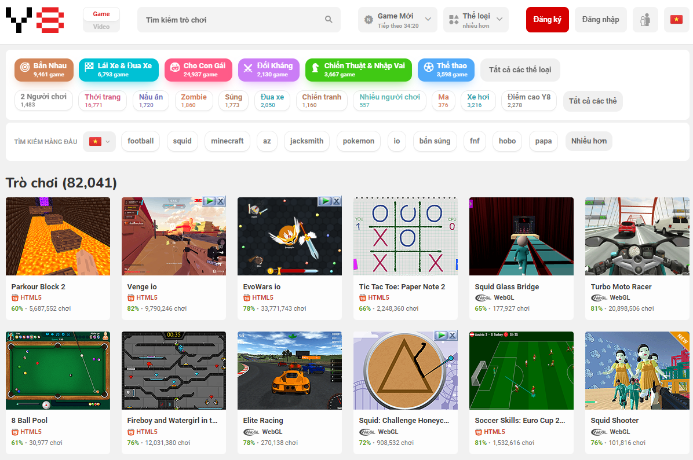
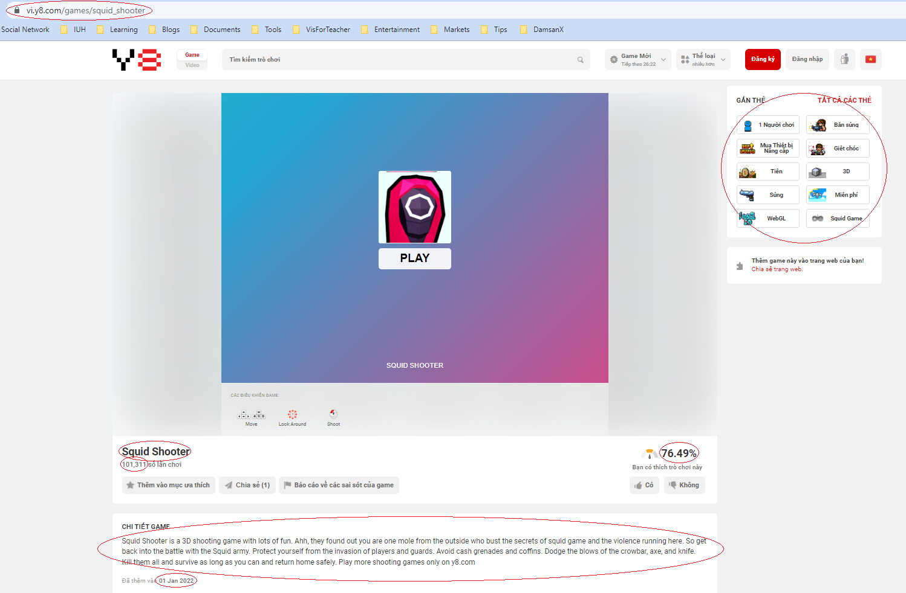
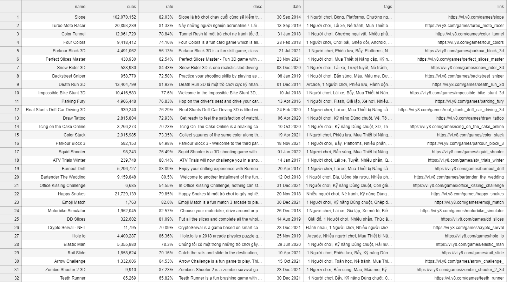

# 1. Giới thiệu
## Y8.com là một trang web tổng hợp nhiều trò chơi với nhiều thể loại đa dạng, phong phú, gắn liền tuổi thơ của nhiều game thủ net cỏ

# 2. Yêu cầu
## - Địa chỉ trang web crawl: `https://vi.y8.com/`
## - Yêu cầu crawl 1024 games
## - Trích xuất các thông tin sau:
- Tên trò chơi (name)
- Số lần chơi (subs)
- Tỷ lệ yêu thích (rate)
- Mô tả trò chơi (desc)
- Ngày thêm thêm vào (date)
- Nhãn của trò chơi (tags)
- Link đến trò chơi trên Y8 (link)

## - Dữ liệu sau khi crawl được lưu vào file `games_data.csv` như mẫu sau (hoặc xem file đính kèm cùng tên trong thư mục `assets`):

