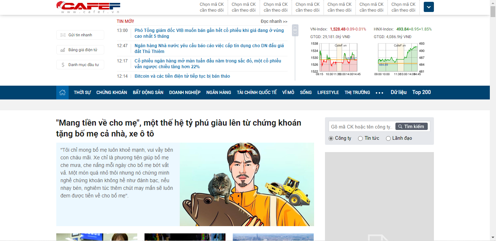
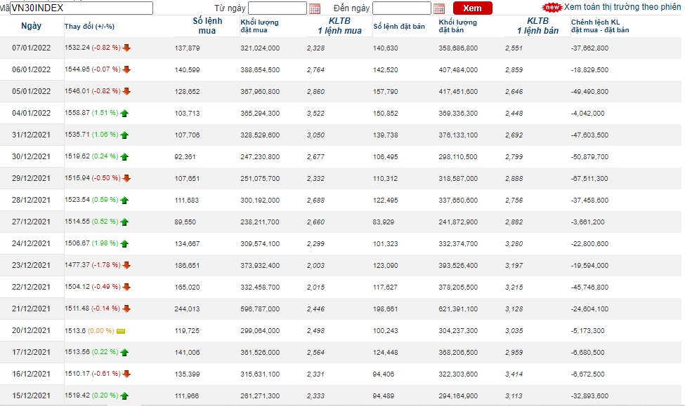
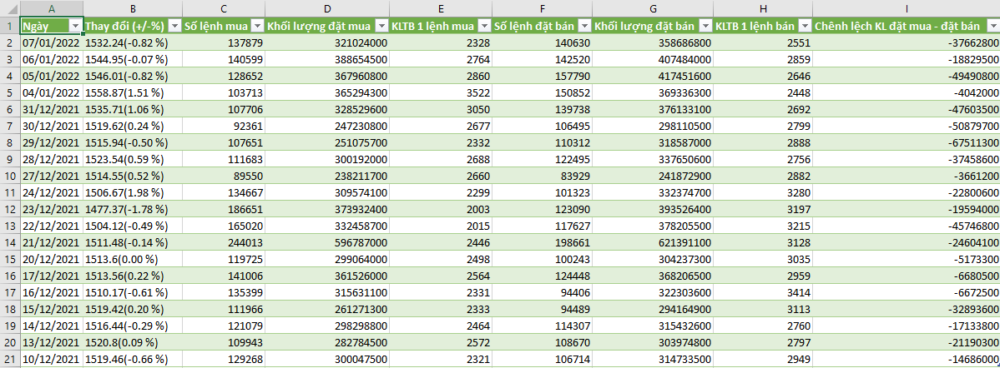

# 1. Giới thiệu
## CafeF là một kênh tin tức kinh tế, tài chính, thông tin chứng khoán của Việt Nam mới nhất được cập nhật liên tục, chính xác và đầy đủ,chuyên sâu.


# 2. Yêu cầu
## - Địa chỉ trang web crawl: `https://cafef.vn`
## - Thu thập dữ liệu ```thống kê đặt lệnh``` của mã cổ phiếu ```VN30INDEX``` trong khoảng thời gian: 10/12/2021 - 07/01/2022
## - Trích xuất các thông tin sau: 
- Ngày 
- Thay đổi (+/-%)
- Số lệnh mua
- Khối lượng đặt mua
- KLTB 1 lệnh mua
- Số lệnh đặt bán
- Khối lượng đặt bán
- KLTB 1 lệnh bán
- Chênh lệch KL đặt mua - đặt bán



## - Dữ liệu sau khi crawl được lưu vào file `thonh_ke_dat_lenh_VN30INDEX.csv`

